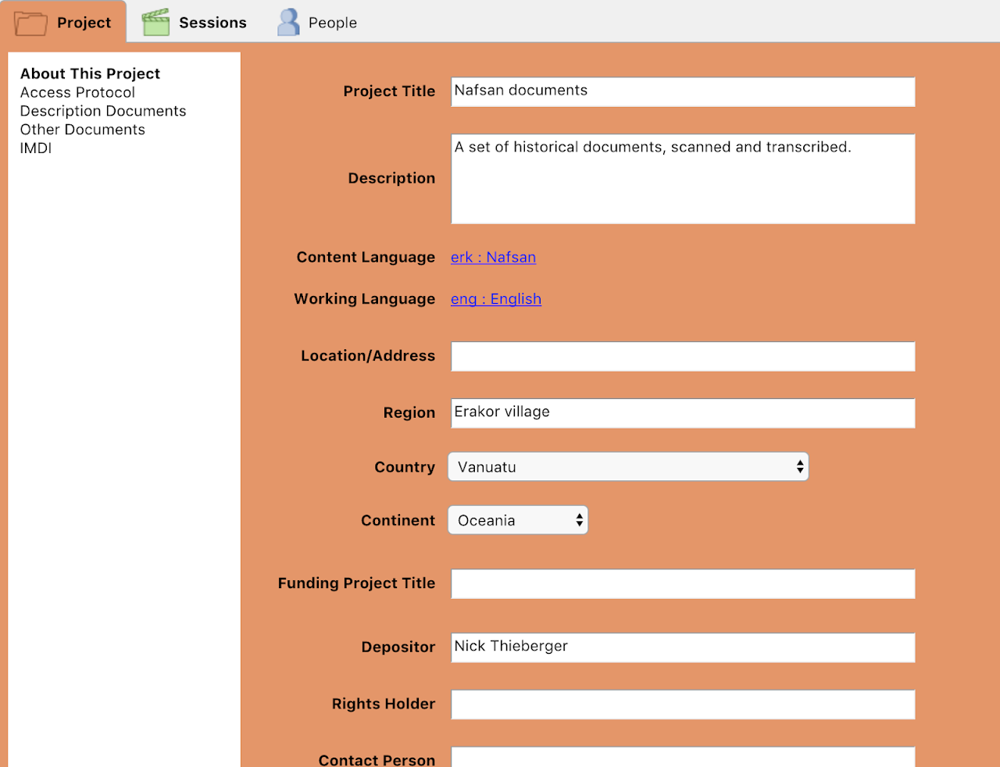
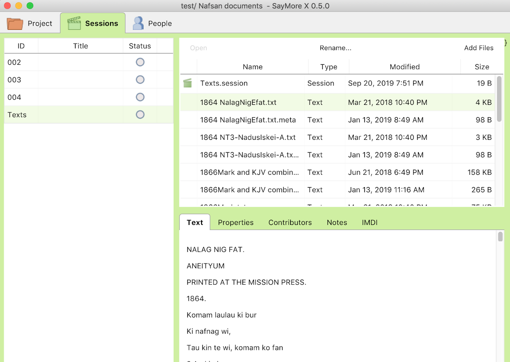

Lameta is a new tool to help with organising collections of files. It is mainly aimed at collections made in the course of documenting language, music, and other cultural expressions.

Lameta greatly simplifies management of collections and makes the archiving process straightforward and painless for field workers.

The need for improved metadata entry tools in language documentation is apparent. Without basic metadata the results of fieldwork, including recordings, texts and so on, become invisible, even to the fieldworker.  On the other hand, with good metadata descriptions this material is accessible for re-use by their creator, and can be easily submitted to an archive for longterm access.

The [survey](http://www.paradisec.org.au%2Fblog%2F2016%2F06%2Fresults-of-the-metadata-surveysurvey) conducted by [COEDL](http://www.dynamicsoflanguage.edu.au) in early 2016 had some 135 responses and revealed that most of the responding researchers do not use existing tools, but rather rely on spreadsheets, text documents or pen and paper.

As a result of discussion at the [2016 LD Tools and Methods Summit](https://sites.google.com%2Fsite%2Fldtoolssummit)  in Melbourne, a group of participants arranged to draw up specifications for development of a tool or tools. Gary Holton at U.Hawaii wrote a funding application to the NSF that resulted in funds being made available for meetings during 2016 and 2017. Further funds from ELDP and CoEDL contributed to the development of Lameta.

Lameta is open source and we hope to build a community of developers to work on new versions.

This project is being led by Gary Holton (U.Hawaii Manoa), Nick Thieberger (U.Melbourne), and Mandana Seyfeddinipur (ELDP, London). Lameta was developed by John Hatton.

The latest version can be downloaded here: <a href="https://github.com/onset/laMETA/releases" class="btn btn--primary">download</a>

(note that the working name for this tool was SayMoreX, but it is now called **Lameta**)

<figure class="half">
    
    
    <figcaption>Lameta sreenshots</figcaption>
</figure>
